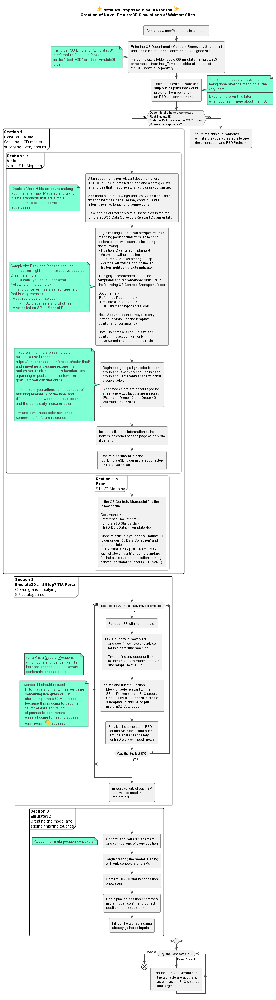

# Emulate3D Theory

## This Living Document


## High Level Overview of Novel Model Creation


## Contribution
Before pushing your changes to this documentation ensure you run ```update.sh``` in the root directory of this 

### How to run update.sh
 - (On Windows) Open this git's root directory in your Git Bash utility
 - (On Linux) Open this git's root directory in your preferred bash terminal
 - Run the following commands

```
chmod +x update.sh
./update.sh
```

### Documentation/Features todo
 - [ ] Design the ProcessOfModelCreation to be something that can be delegated (as in to multiple people)
 - [ ] Expand on the tools required for each "grouping" in ProcessOfModelCreation
 - [ ] Expand on the definition of "grouping" (Find a better/more precise word, but basically imagine a single task that can be delegated) in ProcessOfModelCreation
 - [ ] Expand on the "Living Document" section to detail exactly what and how this repository is meant to guide, and who it's by and for.
 - [ ] Create tools that can assist in data collection 
 - [ ] Create guides for data collection
 - [ ] Create a scope of **everything** required from A-Z to create a novel Emulate3D project
 - [ ] Expand on Emulate3D Catalogue planning
 - [ ] Create reccomended advice for how to engage with projects (where to store it on your pc, what software to use as an end user)
 - [ ] Determine whether Github will be the future of storing this and future repos or some other version control software (please something with issues). 